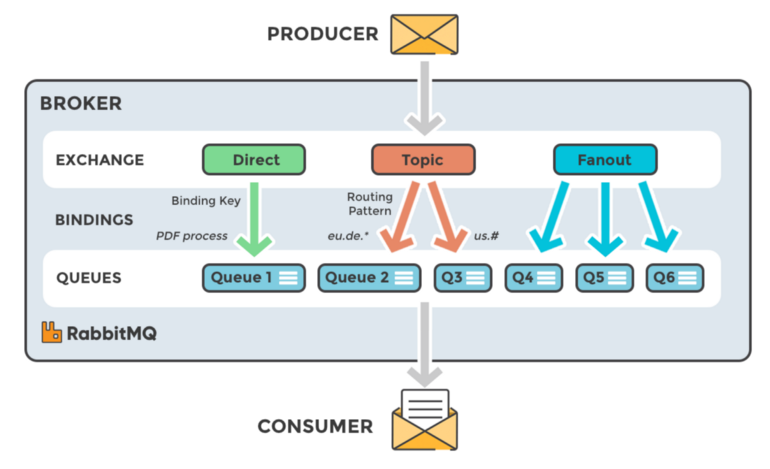

# Tutorial: RabbitMQ, topic and fanout exchange, using Nestjs

This tutorial show how to use rabbitmq topic and fanout exchange in NestJS.
To do this we use an external npm package [golevelup/nestjs-rabbitmq](https://www.npmjs.com/package/@golevelup/nestjs-rabbitmq) because the default module support only the direct exchange

<p align="center">
</p>

## Prerequisites

- docker
- docker-compose

## 🚧 Structure

The project has 2 modules (plus the app module).

- Fanout
- Topic

## 🚀 Running the app 

```bash
$ docker-compose up
```

## 💾 Publish a message

To publish a message in a topic exchange open:

```
http://localhost:3000/topic/topic1
http://localhost:3000/topic/topic2
```

or if you want publish in a fanout open:

```
http://localhost:3000/fanout
```

and see the logs into your terminal

```
nestjs_1    | publishing topic 2
nestjs_1    | Received message from topic 2: {"msg":"publish topic queue2"}
nestjs_1    | publishing topic 1
nestjs_1    | Received message from topic 1: {"msg":"publish topic queue1"}
nestjs_1    | publishing fanout
nestjs_1    | Received message from fanout 2: {"msg":"publish fanout"}
nestjs_1    | Received message from fanout 1: {"msg":"publish fanout"}
nestjs_1    | publishing topic 1
nestjs_1    | Received message from topic 1: {"msg":"publish topic queue1"}
nestjs_1    | publishing topic 2
nestjs_1    | Received message from topic 2: {"msg":"publish topic queue2"}
```
